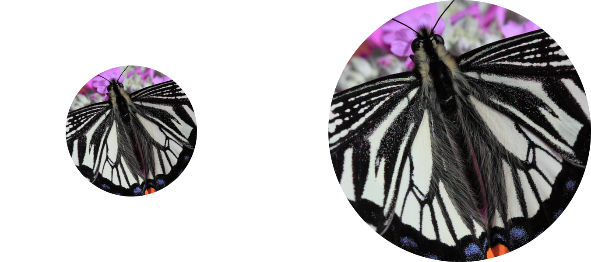

[](https://ainize.web.app/redirect?git_repo=github.com/idealo/image-super-resolution)


# Image Super-Resolution (ISR)



[](https://idealo.github.io/image-super-resolution/)
[](https://github.com/idealo/image-super-resolution/blob/master/LICENSE)

The goal of this project is to upscale and improve the quality of low resolution images.


## ML Model

trained with Adversarial and VGG features losses, choose the option weights='gans' when creating a RRDN model.

### RRDN Network architecture
The main parameters of the architecture structure are:
- T - number of Residual in Residual Dense Blocks (RRDB)
- D - number of Residual Dense Blocks (RDB) insider each RRDB
- C - number of convolutional layers stacked inside a RDB
- G - number of feature maps of each convolutional layers inside the RDBs
- G0 - number of feature maps for convolutions outside of RDBs and of each RBD output


<br>


## How to Run

### Local
```
cd client
cd npm run build
cd ../
pip install --upgrade pip
pip install -e ".[gpu]" --ignore-installed
pip3 install flask 
pip3 install requests
pip3 install flask_cors
python3 ./src/server.py 
```

### Docker

```
sudo docker build -t {Docker Path}:{Tag} .
sudo docker run -p {Expose Port}:80 {Docker Path}:{Tag}
```

## References
* https://github.com/idealo/image-super-resolution
